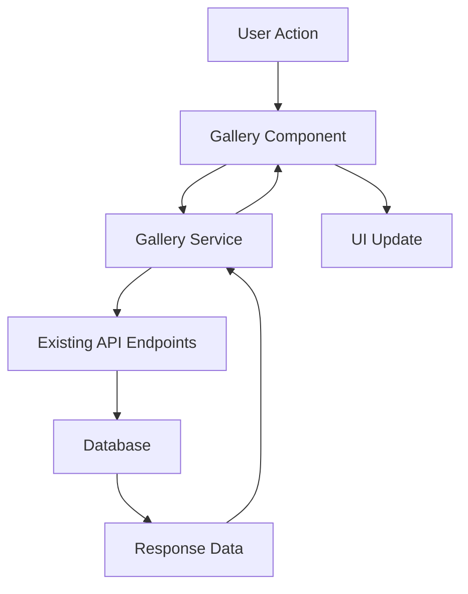

# Design Document

## Overview

The Pixieset-style gallery feature transforms the existing complex gallery system into a simple, elegant photo viewing experience. The design leverages existing robust API endpoints and database schema while creating new UI components focused on visual presentation over management complexity.

The system will consist of four main user-facing pages:

1. **Gallery List Page** - Clean overview of all user galleries
2. **Gallery View Page** - Pixieset-style image grid for individual galleries
3. **Image Lightbox** - Full-screen image viewing with minimal navigation
4. **Create Gallery Modal** - Simple folder-to-gallery creation flow

## Architecture

### Component Hierarchy

```
Gallery System
├── Pages
│   ├── GalleryListPage (/[lang]/gallery)
│   ├── GalleryViewPage (/[lang]/gallery/[id])
│   └── SharedGalleryPage (/[lang]/g/[id])
├── Components
│   ├── GalleryGrid
│   ├── GalleryCard
│   ├── ImageLightbox
│   ├── CreateGalleryModal
│   ├── GalleryEditModal
│   └── GallerySidebar
├── Services
│   ├── galleryService.ts
│   └── mockGalleryData.ts
└── Types
    └── gallery.ts
```

### Data Flow



### URL Structure

- `/[lang]/gallery` - Gallery list page
- `/[lang]/gallery/[id]` - Private gallery view (requires auth)
- `/g/[id]` - Public gallery view (no auth required)
- Future: `/u/[slug]/gallery/[slugOrId]` - SEO-friendly URLs

## Components and Interfaces

### 1. GalleryListPage Component

**Purpose**: Main gallery overview page accessible from sidebar navigation

**Props**: None (uses auth context)

**Key Features**:

- Displays user's own galleries in a responsive grid
- Shows shared galleries in separate section
- Integrates with existing sidebar navigation
- Supports mock data toggle for development

**State Management**:

```typescript
interface GalleryListState {
  ownGalleries: Gallery[];
  sharedGalleries: Gallery[];
  isLoading: boolean;
  error: string | null;
  useMockData: boolean;
}
```

### 2. GalleryViewPage Component

**Purpose**: Individual gallery viewing with Pixieset-style clean interface

**Props**:

```typescript
interface GalleryViewProps {
  galleryId: string;
  isPublic?: boolean;
}
```

**Key Features**:

- Clean image grid without search/filter clutter
- Lazy loading with Next.js Image optimization
- Infinite scroll for large galleries
- Edit/delete buttons for gallery owners
- Privacy controls integration

### 3. Memory Viewer Component

**Purpose**: Full-screen memory viewing with minimal navigation (reuses existing memory viewer)

**Props**:

```typescript
interface GalleryMemoryViewerProps {
  items: (DBGalleryItem & { memory: Memory })[];
  currentIndex: number;
  isOpen: boolean;
  onClose: () => void;
  onNext: () => void;
  onPrevious: () => void;
  allowDownload: boolean;
}
```

**Note**: Reuses existing memory viewer functionality, supporting all memory types (images, videos, documents, notes, audio).

**Accessibility Features**:

- Focus trap implementation
- Keyboard navigation (arrows, escape)
- Screen reader support with aria-live
- Touch gestures for mobile

### 4. CreateGalleryModal Component

**Purpose**: Folder-to-gallery creation interface

**Props**:

```typescript
interface CreateGalleryModalProps {
  isOpen: boolean;
  onClose: () => void;
  onSuccess: (gallery: Gallery) => void;
  availableFolders: FolderInfo[];
}
```

**Features**:

- Lists folders containing images
- Shows image count preview
- Custom title/description input
- Duplicate gallery handling (reuse empty galleries)

### 5. GallerySidebar Enhancement

**Purpose**: Enhanced sidebar navigation for multiple galleries

**Features**:

- Collapsible "Gallery" section
- Scrollable gallery list
- Thumbnail previews on hover
- Separate "Shared Galleries" subsection
- "Create Gallery" quick action

## Data Models

### Database Context

**Gallery** is a simple container for organizing existing memories:

- `galleries` table: Basic metadata (id, title, description, isPublic, ownerId)
- `gallery_items` table: Junction table linking galleries to existing memories with position/caption metadata

**GalleryItem is NOT a separate entity** - it's just a **Memory** (from images/videos/documents/notes/audio tables) with additional gallery-specific metadata (position, caption, isFeatured).

**Future Flexibility**: While the current demo focuses on image galleries (Pixieset-style), the architecture supports galleries containing any memory type (videos, documents, notes, audio) for future use cases.

### Gallery Interface

```typescript
interface Gallery {
  id: string;
  title: string;
  description?: string;
  isPublic: boolean;
  coverImage?: string;
  imageCount: number;
  createdAt: string;
  updatedAt: string;
  ownerId: string;
  isOwner: boolean;
}
```

### GalleryItem Interface

```typescript
interface GalleryItem {
  // Gallery-specific metadata
  id: string; // gallery_item.id
  position: number;
  caption?: string;
  isFeatured: boolean;

  // Reference to existing memory
  memoryId: string;
  memoryType: "image" | "video" | "document" | "note" | "audio";

  // Memory data (populated via join)
  memory: Memory; // Existing Memory type from images/videos/etc.
}
```

**Note**: GalleryItem can contain any memory type, not just images. The current demo focuses on image galleries, but the architecture supports mixed-content galleries for future use cases.

### FolderInfo Interface

```typescript
interface FolderInfo {
  name: string;
  memoryCount: number; // Total memories (images, videos, documents, etc.)
  imageCount: number; // Just images for preview
  previewMemories: string[]; // URLs for preview (prioritize images)
  hasMemories: boolean;
}
```

**Note**: Folders can contain any memory type, but for gallery creation we focus on images for the Pixieset-style experience.

## Error Handling

### Client-Side Error Boundaries

```typescript
interface GalleryErrorBoundaryState {
  hasError: boolean;
  error: Error | null;
  errorInfo: ErrorInfo | null;
}
```

**Error Scenarios**:

- Gallery not found (404)
- Access denied (403)
- Network failures
- Image loading failures
- Large gallery performance issues

### Graceful Degradation

- Skeleton loading states for slow connections
- Fallback images for broken thumbnails
- Progressive image loading
- Offline state handling

## Testing Strategy

### Mock Data Generation

**Gallery Variations**:

- Small galleries (3 images)
- Medium galleries (10-25 images)
- Large galleries (50-100+ images)
- Format-specific galleries (landscape only, portrait only, mixed)
- Wildly mixed aspect ratios

**Mock Data Structure**:

```typescript
interface MockGalleryConfig {
  count: number;
  imageCount: number;
  aspectRatio: "landscape" | "portrait" | "mixed" | "wild";
  titles: string[];
  descriptions: string[];
}
```

### Component Testing

**Unit Tests**:

- Gallery grid rendering with different image counts
- Lightbox keyboard navigation
- Modal form validation
- Sidebar gallery list behavior

**Integration Tests**:

- Gallery creation flow end-to-end
- Image loading and lazy loading
- Privacy setting changes
- Share URL generation

**Performance Tests**:

- Large gallery rendering (100+ images)
- Infinite scroll behavior
- Image preloading effectiveness
- Mobile touch gesture responsiveness

### Accessibility Testing

- Screen reader navigation
- Keyboard-only interaction
- Focus management in modals
- Color contrast compliance
- Touch target sizes

## Performance Considerations

### Image Optimization

**Next.js Image Integration**:

```typescript
<Image
  src={image.url}
  alt={image.title || "Gallery image"}
  width={image.width || 400}
  height={image.height || 300}
  sizes="(max-width: 768px) 100vw, (max-width: 1200px) 50vw, 33vw"
  loading="lazy"
  placeholder="blur"
  blurDataURL="data:image/jpeg;base64,..."
/>
```

**Loading Strategy**:

- Lazy load images below the fold
- Preload first row of images
- Prefetch adjacent images in lightbox
- Progressive JPEG support

### Infinite Scroll Implementation

```typescript
interface InfiniteScrollConfig {
  pageSize: number;
  threshold: number; // pixels from bottom to trigger load
  maxPages: number;
  loadingState: "idle" | "loading" | "error";
}
```

### Caching Strategy

- Gallery metadata caching (5 minutes)
- Image thumbnail caching (24 hours)
- Folder list caching (1 minute)
- User gallery list caching (2 minutes)

## Security Considerations

### Access Control

**Gallery Privacy Levels**:

- Private: Only owner can access
- Public: Anyone with link can access
- Shared: Specific users can access

**URL Security**:

- Private galleries return 404 for anonymous users
- Public galleries accessible via /g/:id
- Share tokens for temporary access

### Data Validation

**Input Sanitization**:

- Gallery titles and descriptions
- Folder names
- User-provided metadata

**File Access Control**:

- Verify user owns images before adding to gallery
- Check image file permissions
- Validate image URLs and paths

## Integration Points

### Existing API Endpoints

**Reused Endpoints**:

- `GET /api/galleries` - List user galleries
- `POST /api/galleries` - Create gallery from folder
- `GET /api/galleries/[id]` - Get gallery details
- `PATCH /api/galleries/[id]` - Update gallery
- `DELETE /api/galleries/[id]` - Delete gallery

**New Endpoints Needed**:

- `GET /api/folders/with-images` - List folders containing images
- `GET /api/galleries/[id]/images` - Get gallery images with pagination

### Database Schema Integration

**Existing Tables Used**:

- `galleries` - Gallery metadata
- `galleryItems` - Gallery-image relationships
- `galleryShares` - Gallery sharing permissions
- `images` - Image data and metadata

**Schema Enhancements**:

- Add `allowDownloads` boolean to galleries table
- Add `coverImageId` reference to galleries table
- Add image dimensions to metadata for layout shift prevention

### Sidebar Navigation Integration

**Navigation Enhancement**:

```typescript
// Update src/utils/navigation.ts
const galleryNavItem = {
  href: "/gallery",
  icon: Grid,
  label: "Gallery",
  translationKey: "gallery",
  subItems: [], // Populated dynamically with user galleries
};
```

## Analytics and Telemetry

### Event Tracking

**Gallery Events**:

- `gallery_created` - Gallery creation with folder source
- `gallery_published` - Privacy changed to public
- `gallery_shared` - Gallery shared with users
- `gallery_deleted` - Gallery deletion

**Image Events**:

- `image_viewed` - Image opened in lightbox
- `image_navigated` - Next/previous in lightbox
- `image_downloaded` - Image download action

**Performance Events**:

- `gallery_load_time` - Time to first image render
- `lightbox_open_time` - Time to open lightbox
- `infinite_scroll_trigger` - Scroll-based loading events

### User Journey Tracking

**Key Metrics**:

- Time from gallery creation to first publish
- Average images per gallery
- Most common gallery sizes
- Share vs. private gallery ratio
- Mobile vs. desktop usage patterns

## Migration Strategy

### Phase 1: Core Gallery Pages

- Implement GalleryListPage with mock data
- Create GalleryViewPage with basic grid
- Add ImageLightbox component
- Update sidebar navigation

### Phase 2: Gallery Management

- Implement CreateGalleryModal
- Add gallery editing capabilities
- Integrate privacy controls
- Add delete functionality

### Phase 3: Performance & Polish

- Implement infinite scroll
- Add image preloading
- Optimize for mobile
- Add analytics tracking

### Phase 4: Advanced Features

- Implement gallery sharing
- Add download controls
- Create public gallery URLs
- Add SEO-friendly URLs

This design maintains the simplicity goal while leveraging existing infrastructure and providing a solid foundation for future enhancements.
