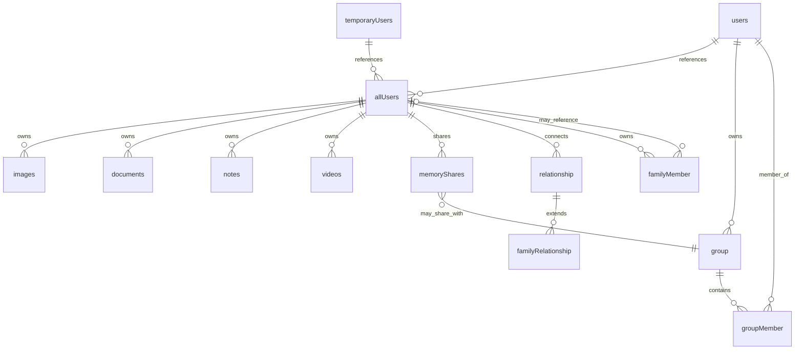

# Database Schema Analysis

## Overview

Futura uses **PostgreSQL** with **Drizzle ORM** for a sophisticated data model that supports complex user relationships, memory preservation, and flexible sharing mechanisms. The schema is designed to handle both temporary and permanent users, family trees, and multi-type memory storage.

## Core Architecture Patterns

### 1. Dual User System

The database implements a **unified user system** to handle both permanent and temporary users:

```
allUsers (unified reference)
├── users (permanent, NextAuth.js compatible)
└── temporaryUsers (temporary, onboarding flow)
```

This pattern enables seamless onboarding where users can upload memories before registration.

### 2. Memory Type Polymorphism

Content is stored across type-specific tables with a unified sharing system:

```
Memory Types:
├── images (photos with metadata)
├── documents (files with MIME types)
├── notes (text-based memories)
└── videos (video files with duration)
```

## Table Structure Analysis

### Authentication Tables (NextAuth.js Compatible)

#### `users` - Primary User Accounts

```sql
CREATE TABLE "user" (
  id TEXT PRIMARY KEY,
  name TEXT,
  email TEXT UNIQUE,
  emailVerified TIMESTAMP,
  image TEXT,
  password TEXT,                    -- For credentials provider
  username TEXT UNIQUE,
  parentId TEXT,                    -- Hierarchical user structure
  invitedByAllUserId TEXT,          -- Invitation tracking
  registrationStatus TEXT,          -- Onboarding progress
  role TEXT,                        -- Access control
  plan TEXT,                        -- Subscription tier
  premiumExpiresAt TIMESTAMP,
  createdAt TIMESTAMP,
  updatedAt TIMESTAMP,
  metadata JSON
);
```

**Key Features**:

- NextAuth.js compatible fields (`id`, `name`, `email`, `emailVerified`, `image`)
- Custom fields for business logic
- Role-based access control (`user`, `moderator`, `admin`, `developer`, `superadmin`)
- Subscription management (`free`, `premium`)
- Invitation system integration

#### `temporaryUsers` - Onboarding System

```sql
CREATE TABLE "temporary_user" (
  id TEXT PRIMARY KEY,
  name TEXT,
  email TEXT,
  secureCode TEXT NOT NULL,         -- Access without authentication
  secureCodeExpiresAt TIMESTAMP,
  role TEXT,                        -- 'inviter' | 'invitee'
  invitedByAllUserId TEXT,
  registrationStatus TEXT,
  metadata JSON
);
```

**Purpose**: Enables anonymous memory uploads before user registration.

#### `allUsers` - Unified Reference System

```sql
CREATE TABLE "all_user" (
  id TEXT PRIMARY KEY,
  type TEXT,                        -- 'user' | 'temporary'
  userId TEXT,                      -- FK to users (nullable)
  temporaryUserId TEXT              -- FK to temporaryUsers (nullable)
);
```

**Design Pattern**: Exactly one of `userId` or `temporaryUserId` must be non-null, creating a polymorphic reference system.

### Memory Storage Tables

#### `images` - Photo Storage

```sql
CREATE TABLE "image" (
  id TEXT PRIMARY KEY,
  ownerId TEXT REFERENCES all_user(id),
  url TEXT NOT NULL,
  caption TEXT,
  title TEXT,
  description TEXT,
  ownerSecureCode TEXT NOT NULL,    -- Management access
  isPublic BOOLEAN DEFAULT false,
  metadata JSON,                    -- ImageMetadata + custom fields
  createdAt TIMESTAMP
);
```

**Metadata Structure**:

```typescript
type ImageMetadata = {
  size: number;
  mimeType: string;
  originalName: string;
  uploadedAt: string;
  dateOfMemory?: string;
  peopleInMemory?: string[];
  dimensions?: { width: number; height: number };
  custom?: { [key: string]: any };
};
```

#### `documents` - File Storage

Similar structure to images but optimized for document storage with MIME type handling.

#### `notes` - Text Memories

```sql
CREATE TABLE "note" (
  id TEXT PRIMARY KEY,
  ownerId TEXT REFERENCES all_user(id),
  title TEXT NOT NULL,
  content TEXT NOT NULL,
  ownerSecureCode TEXT NOT NULL,
  isPublic BOOLEAN DEFAULT false,
  metadata JSON,                    -- Rich metadata support
  createdAt TIMESTAMP,
  updatedAt TIMESTAMP
);
```

**Note Metadata**:

```typescript
type NoteMetadata = {
  tags?: string[];
  mood?: string;
  location?: string;
  dateOfMemory?: string;
  recipients?: string[];
  unlockDate?: string;              -- Future feature
  custom?: CustomMetadata;
}
```

### Relationship System

#### `relationship` - User Connections

```sql
CREATE TABLE "relationship" (
  id TEXT PRIMARY KEY,
  userId TEXT REFERENCES all_user(id),
  relatedUserId TEXT REFERENCES all_user(id),
  type TEXT,                        -- 'friend', 'colleague', 'family', etc.
  status TEXT DEFAULT 'pending',    -- 'pending', 'accepted', 'declined'
  note TEXT,
  createdAt TIMESTAMP,
  UNIQUE(userId, relatedUserId)
);
```

#### `familyRelationship` - Extended Family Data

```sql
CREATE TABLE "family_relationship" (
  id TEXT PRIMARY KEY,
  relationshipId TEXT REFERENCES relationship(id),
  familyRole TEXT,                  -- Specific family role
  relationshipClarity TEXT,         -- 'resolved' | 'fuzzy'
  sharedAncestorId TEXT REFERENCES all_user(id),
  createdAt TIMESTAMP
);
```

#### `familyMember` - Family Tree Nodes

```sql
CREATE TABLE "family_member" (
  id TEXT PRIMARY KEY,
  ownerId TEXT REFERENCES all_user(id),
  userId TEXT REFERENCES all_user(id),  -- Optional registered user link
  fullName TEXT NOT NULL,
  primaryRelationship TEXT,             -- Primary role (son, daughter, etc.)
  fuzzyRelationships TEXT[],            -- Array of potential relationships
  birthDate TIMESTAMP,
  deathDate TIMESTAMP,
  birthplace TEXT,
  metadata JSON
);
```

**Relationship Types**:

- **Primary**: `son`, `daughter`, `father`, `mother`, `sibling`, `spouse`
- **Fuzzy**: `parent`, `child`, `grandparent`, `aunt_uncle`, `cousin`, etc.

### Sharing System

#### `memoryShares` - Flexible Sharing Model

```sql
CREATE TABLE "memory_share" (
  id TEXT PRIMARY KEY,
  memoryId TEXT NOT NULL,           -- Polymorphic reference to any memory type
  memoryType TEXT,                  -- 'image', 'document', 'note', 'video'
  ownerId TEXT REFERENCES all_user(id),
  sharedWithType TEXT,              -- 'user', 'group', 'relationship'
  sharedWithId TEXT,                -- Direct user sharing
  groupId TEXT REFERENCES group(id), -- Group sharing
  sharedRelationshipType TEXT,      -- Relationship-based sharing
  accessLevel TEXT DEFAULT 'read',  -- 'read', 'write'
  inviteeSecureCode TEXT NOT NULL,  -- Access mechanism
  createdAt TIMESTAMP
);
```

**Sharing Strategies**:

1. **Direct User Sharing**: Share with specific users
2. **Group Sharing**: Share with defined groups
3. **Relationship-Based Sharing**: Dynamic sharing based on relationship types

**Relationship-Based Sharing Types**:

- `close_family` (parents, siblings)
- `family` (extended family)
- `partner` (romantic partner)
- `close_friend` (trusted friends)
- `friend` (regular friends)
- `colleague` (work relationships)
- `acquaintance` (casual relationships)

## Data Relationships Diagram



## Key Design Decisions

### 1. Foreign Key Strategy

- **Commented out** in some tables to handle race conditions during user creation
- **Retry logic** implemented in application code for user verification
- **Exponential backoff** for handling concurrent operations

### 2. Secure Code System

- Every memory has an `ownerSecureCode` for management access
- Memory shares have `inviteeSecureCode` for recipient access
- Enables access without traditional authentication

### 3. Metadata Flexibility

- **JSON fields** for extensible metadata
- **Typed interfaces** in TypeScript for structure
- **Custom metadata** support for user-defined fields

### 4. Polymorphic References

- `allUsers` table enables unified referencing
- `memoryShares` supports multiple memory types
- Flexible sharing mechanisms without complex joins

## Performance Considerations

### Indexes

- **Unique indexes** on critical fields (email, username)
- **Composite indexes** for relationship uniqueness
- **Foreign key indexes** for join performance

### Scalability Patterns

- **Polymorphic tables** reduce schema complexity
- **JSON metadata** provides flexibility without schema migrations
- **Relationship-based sharing** reduces static sharing records

## Security Features

### Access Control

- **Role-based permissions** at user level
- **Secure codes** for temporary access
- **Public/private flags** on all memory types
- **Access levels** in sharing (read/write)

### Data Integrity

- **Foreign key constraints** ensure referential integrity
- **Enum constraints** prevent invalid status values
- **Unique constraints** prevent duplicate relationships
- **Not null constraints** on critical fields

This schema design supports Futura's complex requirements while maintaining flexibility for future growth and feature additions.
