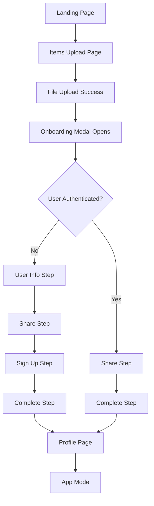

# UX & Onboarding Flow Analysis

## Overview

Futura implements a sophisticated **onboarding flow** designed to minimize friction while collecting necessary user information and creating their first memory. The system uses a **temporary user approach** that allows anonymous uploads before registration, ensuring users can experience value before commitment.

## Onboarding Architecture

### 1. Flow Structure

#### Two-Phase Onboarding

```
Phase 1: Items Upload
├── Anonymous file upload
├── Temporary user creation
├── Modal flow initiation
└── User data collection

Phase 2: Profile Setup
├── Memory display
├── Account completion
├── Authentication integration
└── Transition to app mode
```

### 2. User Journey Mapping

#### Complete Flow Sequence



#### Step Sequences by Authentication Status

```typescript
// Unauthenticated users
const UNAUTHENTICATED_STEPS = [
  "upload", // File upload
  "user-info", // Name & email collection
  "share", // Sharing configuration
  "sign-up", // Account creation
  "complete", // Success confirmation
];

// Authenticated users
const AUTHENTICATED_STEPS = [
  "upload", // File upload
  "share", // Sharing configuration
  "complete", // Success confirmation
];
```

## Page-Level Components

### 1. Items Upload Page (`/[lang]/onboarding/items-upload`)

#### Server Component (page.tsx)

```typescript
export default async function ItemsUploadPage({ params }: PageProps) {
  const resolvedParams = await params;
  const dict = await getDictionary(resolvedParams.lang, {
    includeOnboarding: true,
  });

  return <ItemsUploadClient lang={resolvedParams.lang} dict={dict} />;
}
```

#### Client Component (items-upload-client.tsx)

```typescript
export default function ItemsUploadClient({ lang, dict }: Props) {
  const [showOnboardModal, setShowOnboardModal] = useState(false);
  const { setMode } = useInterface();
  const router = useRouter();

  const handleUploadSuccess = () => {
    setShowOnboardModal(true); // Open modal after successful upload
  };

  const handleOnboardingComplete = () => {
    setShowOnboardModal(false);
    setMode("app"); // Switch to app interface
    router.push(`/${lang}/onboarding/profile`); // Navigate to profile
  };

  return (
    <div className="onboarding-layout">
      <h1>{copy.title}</h1>
      <p>{copy.subtitle}</p>

      <MemoryUpload isOnboarding variant="large-icon" onSuccess={handleUploadSuccess} />

      <OnboardModal isOpen={showOnboardModal} onClose={handleModalClose} onComplete={handleOnboardingComplete} />
    </div>
  );
}
```

**Key Features**:

- **Large, prominent upload interface** with visual emphasis
- **Dictionary-driven content** with variation support
- **Modal trigger** on successful upload
- **Interface mode switching** (marketing → app)
- **Language-aware navigation**

### 2. Profile Page (`/[lang]/onboarding/profile`)

#### Suspense-Wrapped Architecture

```typescript
function OnboardingProfilePage() {
  const searchParams = useSearchParams();
  const fileUrl = searchParams.get("fileUrl");
  const fileName = searchParams.get("fileName");

  // Recreate file object from URL parameters
  const uploadedFile =
    fileUrl && fileName
      ? {
          url: fileUrl,
          file: new File([], fileName),
        }
      : null;

  return <Profile isOnboarding={true} uploadedFile={uploadedFile} />;
}

export default function SuspenseWrappedOnboardingProfilePage() {
  return (
    <Suspense fallback={<Profile isOnboarding={true} />}>
      <OnboardingProfilePage />
    </Suspense>
  );
}
```

**Design Decisions**:

- **Suspense boundary** for client-side hydration
- **URL parameter passing** for file data
- **Fallback UI** during loading
- **Onboarding mode flag** for Profile component

## Modal-Based Flow Components

### 1. OnboardModal - Flow Orchestrator

#### State Management

```typescript
export function OnboardModal({ isOpen, onClose }: Props) {
  const { currentStep, setCurrentStep, userData, setOnboardingStatus, updateUserData } = useOnboarding();

  const { status } = useSession(); // NextAuth.js integration
  const { toast } = useToast(); // Notification system

  const handleNext = async () => {
    switch (currentStep) {
      case "upload":
      // File upload completion logic
      case "user-info":
      // User information validation and processing
      case "share":
      // Sharing configuration handling
      case "sign-up":
      // Account creation process
    }
  };
}
```

#### Conditional Step Rendering

```typescript
return (
  <Dialog open={showModal} onOpenChange={onClose}>
    <DialogContent className="max-w-md">
      <VisuallyHidden asChild>
        <DialogTitle>
          {currentStep === "user-info" && "Enter Your Information"}
          {currentStep === "share" && "Share Your Memory"}
          {currentStep === "sign-up" && "Create Your Account"}
        </DialogTitle>
      </VisuallyHidden>

      {currentStep === "user-info" && (
        <UserInfoStep
          withImage={false}
          collectEmail={true}
          onNext={handleNext}
          onBack={handleBack}
          isReadOnly={status === "authenticated"}
        />
      )}

      {currentStep === "share" && <ShareStep onNext={handleNext} onBack={handleBack} />}

      {currentStep === "sign-up" && status !== "authenticated" && <SignUpStep onBack={handleBack} />}
    </DialogContent>
  </Dialog>
);
```

### 2. Step Components

#### UserInfoStep - Data Collection

```typescript
export function UserInfoStep({ withImage = false, collectEmail = true, onNext, onBack, isReadOnly = false }: Props) {
  const { userData, updateUserData, files } = useOnboarding();

  // Local state for immediate UI feedback
  const [localName, setLocalName] = useState(userData.name);
  const [localEmail, setLocalEmail] = useState(userData.email);

  // Auto-focus management
  const nameInputRef = useRef<HTMLInputElement>(null);
  const emailInputRef = useRef<HTMLInputElement>(null);

  // Email validation
  const validateEmail = (email: string) => {
    const emailRegex = /^[A-Z0-9._%+-]+@[A-Z0-9.-]+\.[A-Z]{2,}$/i;
    return emailRegex.test(email);
  };

  const handleNext = () => {
    if (!localName.trim()) {
      toast({ title: "Please enter your name" });
      return;
    }

    if (collectEmail && !validateEmail(localEmail)) {
      toast({ title: "Please enter a valid email" });
      return;
    }

    onNext();
  };
}
```

**UX Features**:

- **Auto-focus management** for seamless keyboard navigation
- **Real-time validation** with user feedback
- **Local state synchronization** with global context
- **Conditional field collection** based on props
- **Read-only mode** for authenticated users

#### ShareStep - Relationship Configuration

```typescript
export function ShareStep({ onNext, onBack }: Props) {
  const { userData, updateUserData } = useOnboarding();

  const [recipientName, setRecipientName] = useState(userData.recipientName);
  const [recipientEmail, setRecipientEmail] = useState(userData.recipientEmail);
  const [relationship, setRelationship] = useState(userData.relationship);
  const [familyRelationship, setFamilyRelationship] = useState(userData.familyRelationship);

  // Dynamic relationship options
  const relationshipOptions = [
    { value: "family", label: "Family Member" },
    { value: "friend", label: "Friend" },
    { value: "colleague", label: "Colleague" },
    { value: "other", label: "Other" },
  ];

  // Family-specific relationship options
  const familyRelationshipOptions = [
    { value: "parent", label: "Parent" },
    { value: "child", label: "Child" },
    { value: "sibling", label: "Sibling" },
    { value: "grandparent", label: "Grandparent" },
    { value: "grandchild", label: "Grandchild" },
  ];
}
```

#### SignUpStep - Account Creation

```typescript
export function SignUpStep({ onBack }: Props) {
  const { userData } = useOnboarding();
  const [isLoading, setIsLoading] = useState(false);

  const handleSignUp = async () => {
    setIsLoading(true);
    try {
      // Account creation logic
      const result = await signIn("credentials", {
        email: userData.email,
        password: "temporary", // Or generated password
        redirect: false,
      });

      if (result?.ok) {
        toast({ title: "Account created successfully!" });
      }
    } catch (error) {
      toast({ title: "Failed to create account" });
    } finally {
      setIsLoading(false);
    }
  };
}
```

## Context-Driven State Management

### 1. OnboardingContext Architecture

#### State Structure

```typescript
interface OnboardingContextType {
  // File management
  files: TempFile[];
  addFile: (file: TempFile) => void;
  removeFile: (url: string) => void;
  clearFiles: () => void;

  // Step navigation
  currentStep: OnboardingStep;
  setCurrentStep: (step: OnboardingStep) => void;

  // User data collection
  userData: {
    name: string;
    email: string;
    recipientName: string;
    recipientEmail: string;
    relationship: string;
    familyRelationship: string;
    isTemporary: boolean;
    allUserId?: string;
    memoryId?: string;
  };
  updateUserData: (update: Partial<UserData>) => void;

  // Status tracking
  onboardingStatus: OnboardingStatus;
  setOnboardingStatus: (status: OnboardingStatus) => void;
}
```

#### Persistence Strategy

```typescript
export function OnboardingProvider({ children }: Props) {
  // Load state from localStorage on mount
  useEffect(() => {
    const savedState = localStorage.getItem(ONBOARDING_STATE_KEY);
    const savedStep = localStorage.getItem(ONBOARDING_STEP_KEY);

    if (savedState && savedStep) {
      try {
        const state = JSON.parse(savedState);
        setUserData(state.userData);
        setOnboardingStatus(state.onboardingStatus);
        setCurrentStep(savedStep as OnboardingStep);
      } catch (error) {
        console.error("Error loading onboarding state:", error);
      }
    }
  }, []);

  // Save state to localStorage when it changes
  useEffect(() => {
    localStorage.setItem(
      ONBOARDING_STATE_KEY,
      JSON.stringify({
        userData,
        onboardingStatus,
      })
    );
    localStorage.setItem(ONBOARDING_STEP_KEY, currentStep);
  }, [currentStep, userData, onboardingStatus]);
}
```

### 2. Custom Hooks

#### useStepNavigation

```typescript
export function useStepNavigation() {
  const { currentStep, setCurrentStep } = useOnboarding();
  const { status } = useSession();

  // Dynamic step sequences based on authentication
  const steps = status === "authenticated" ? AUTHENTICATED_STEPS : UNAUTHENTICATED_STEPS;

  const currentStepIndex = steps.indexOf(currentStep);

  return {
    currentStep,
    canGoBack: currentStepIndex > 0,
    canGoForward: currentStepIndex < steps.length - 1,
    goToNextStep: () => setCurrentStep(steps[currentStepIndex + 1]),
    goToPreviousStep: () => setCurrentStep(steps[currentStepIndex - 1]),
    goToStep: (step: OnboardingStep) => setCurrentStep(step),
  };
}
```

## UX Design Patterns

### 1. Progressive Disclosure

- **Minimal initial interface** (just upload button)
- **Modal overlay** for detailed information collection
- **Step-by-step progression** to avoid overwhelming users
- **Conditional fields** based on user selections

### 2. Immediate Value Delivery

- **Upload first, register later** approach
- **Temporary user system** for anonymous uploads
- **Visual confirmation** of successful uploads
- **Preview of uploaded content** in profile

### 3. Accessibility Features

- **Auto-focus management** for keyboard navigation
- **Screen reader support** with proper ARIA labels
- **Visible focus indicators** throughout the flow
- **Error messaging** with clear guidance

### 4. Mobile-First Design

- **Responsive layouts** with Tailwind CSS
- **Touch-friendly interface** elements
- **Modal sizing** appropriate for mobile screens
- **Keyboard handling** for mobile browsers

## Data Flow Architecture

### 1. File Upload Process

```
User selects file
    ↓
MemoryUpload component processes
    ↓
File uploaded to Vercel Blob
    ↓
Temporary user created with secure code
    ↓
Memory record created in database
    ↓
onSuccess callback triggers modal
    ↓
Modal flow begins
```

### 2. User Data Collection

```
User enters information in steps
    ↓
Local state updates (immediate UI feedback)
    ↓
Context state updates (global state)
    ↓
localStorage persistence (session recovery)
    ↓
Database updates (permanent storage)
```

### 3. Authentication Integration

```
User completes sign-up step
    ↓
NextAuth.js credentials provider
    ↓
Database user record creation
    ↓
Session establishment
    ↓
Temporary user → permanent user migration
    ↓
App mode activation
```

## Performance Optimizations

### 1. Code Splitting

- **Dynamic imports** for modal components
- **Lazy loading** of step components
- **Conditional rendering** based on authentication state

### 2. State Management

- **Local state** for immediate UI feedback
- **Context state** for global coordination
- **Debounced updates** for expensive operations

### 3. File Handling

- **Object URL management** with cleanup
- **File validation** before upload
- **Progress indicators** for user feedback

## Error Handling & Recovery

### 1. Validation Patterns

- **Real-time validation** with immediate feedback
- **Form submission validation** with error prevention
- **Email format validation** with regex patterns
- **Required field validation** with user guidance

### 2. Error Recovery

- **localStorage persistence** for session recovery
- **Graceful degradation** when services unavailable
- **Retry mechanisms** for failed operations
- **Clear error messaging** with next steps

### 3. Edge Cases

- **Duplicate email handling** during sign-up
- **File upload failures** with retry options
- **Network connectivity issues** with offline support
- **Browser compatibility** with fallbacks

## Current Status & Recommendations

### ✅ Strong UX Patterns

- **Friction-reduced onboarding** with anonymous uploads
- **Progressive disclosure** preventing overwhelm
- **Immediate value delivery** before commitment
- **Comprehensive state management** with persistence
- **Accessibility considerations** throughout

### 🔄 Areas for Enhancement

- **A/B testing integration** for conversion optimization
- **Analytics tracking** for funnel analysis
- **Onboarding completion metrics** for optimization
- **User feedback collection** for continuous improvement
- **Mobile experience testing** for edge cases

### 📋 Technical Debt

- **Large component files** could be further modularized
- **Error boundary implementation** for better error handling
- **Unit testing coverage** for critical flows
- **Performance monitoring** for slow operations

This onboarding flow represents a sophisticated approach to user acquisition that prioritizes user experience while collecting necessary information for the platform's functionality.
