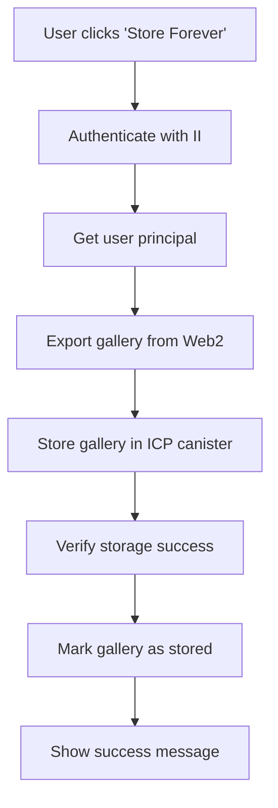

# Store Gallery Forever - UX Planning & Technical Architecture

## Technical Architecture

### Data Flow



### Canister Data Structures

```rust
// Gallery storage in canister - MINIMAL ABSTRACTION APPROACH
// A Gallery is a collection/curation of existing memories
// Only store what we actually need beyond what memories already have

#[derive(CandidType, Serialize, Deserialize, Clone, Debug)]
pub struct Gallery {
    pub id: String,
    pub owner_principal: Principal,
    pub title: String,
    pub description: Option<String>,
    pub is_public: bool,
    pub created_at: u64,
    pub updated_at: u64,
    pub storage_status: GalleryStorageStatus,
    pub memory_entries: Vec<GalleryMemoryEntry>, // Minimal extra data
}

#[derive(CandidType, Serialize, Deserialize, Clone, Debug)]
pub struct GalleryMemoryEntry {
    pub memory_id: String,
    pub position: u32,                    // Gallery-specific ordering
    pub gallery_caption: Option<String>,  // Only if different from memory caption
    pub is_featured: bool,                // Gallery-specific highlighting
    pub gallery_metadata: String,         // JSON for gallery-specific annotations
}

#[derive(CandidType, Serialize, Deserialize, Clone, Debug)]
pub enum GalleryStorageStatus {
    Web2Only,
    ICPOnly,
    Both,
    Migrating,
    Failed,
}
```

### Key Understanding: Gallery vs Memory

#### **Gallery (Collection/Curation)**

- **Purpose**: A way to organize and display existing memories
- **Content**: References to existing memories (images, videos, documents, notes, audio)
- **Structure**: Metadata + ordered list of memory references
- **Storage**: Gallery metadata and item ordering

#### **Memory (Actual Content)**

- **Purpose**: The actual content (image file, video file, document, etc.)
- **Storage**: Already handled by existing memory system
- **Location**: Can be in Web2 (PostgreSQL) or Web3 (ICP blob storage)

#### **GalleryMemoryEntry (Minimal Extra Data)**

- **Purpose**: Only store what memories don't already have
- **Content**: Position, gallery-specific caption, featured status, gallery metadata
- **Minimal**: No redundant data like memory type (already in memory)
- **Context**: Same memory can appear in multiple galleries with different metadata

### API Endpoints

#### New Canister Methods

```candid
service : {
    // Gallery storage (collections of existing memories)
    "store_gallery_forever": (GalleryData) -> (StoreGalleryResponse);
    "get_user_galleries": (Principal) -> (vec Gallery) query;
    "get_gallery_by_id": (String) -> (opt Gallery) query;

    "update_gallery": (String, GalleryUpdateData) -> (UpdateGalleryResponse);
    "delete_gallery": (String) -> (DeleteGalleryResponse);

    // User principal management
    "register_user_principal": (Principal) -> (RegisterUserResponse);
    "link_user_principal": (Principal, String) -> (LinkUserResponse);
    "get_user_by_principal": (Principal) -> (opt UserData) query;
}
```

#### Frontend Service Methods

```typescript
// Gallery storage service
interface GalleryStorageService {
  storeGalleryForever(galleryId: string): Promise<StoreGalleryResponse>;
  getUserICPGalleries(): Promise<Gallery[]>;
  getGalleryStorageStatus(galleryId: string): Promise<GalleryStorageStatus>;
  verifyGalleryStorage(galleryId: string): Promise<VerificationResult>;
}
```

## User Experience Flow

### 1. **Gallery View**

- User views their gallery in the existing interface
- "Store Forever" button is prominently displayed
- Button shows current storage status (Web2, ICP, Both)

### 2. **Storage Initiation**

- User clicks "Store Forever" button
- System checks if user is authenticated with II
- If not authenticated, prompts for II authentication

### 3. **Authentication Flow**

- Opens II authentication popup
- User authenticates with their II identity
- System creates or links user principal

### 4. **Storage Process**

- Shows progress modal with steps:
  1. "Preparing gallery data..."
  2. "Uploading to Internet Computer..."
  3. "Verifying storage..."
  4. "Complete!"
- Each step shows progress and handles errors

### 5. **Completion**

- Shows success message with gallery link
- Updates gallery status to show ICP storage
- Provides option to view stored gallery

## Security Considerations

### 1. **Authentication Security**

- Leverage existing II authentication system
- Verify user principal ownership
- Prevent unauthorized gallery storage

### 2. **Data Integrity**

- Verify data during migration
- Use cryptographic hashes for verification
- Implement rollback on failures

### 3. **Access Control**

- Ensure only gallery owners can store galleries
- Verify user permissions before storage
- Maintain privacy settings during migration

## Performance Considerations

### 1. **Large File Handling**

- Implement chunked upload for large files
- Use efficient blob storage strategies
- Handle timeouts gracefully

### 2. **Storage Optimization**

- Compress data where appropriate
- Use efficient data structures
- Implement caching strategies

### 3. **User Experience**

- Show progress indicators
- Handle long-running operations
- Provide clear feedback

## Success Metrics

### 1. **User Adoption**

- Number of galleries stored forever
- User engagement with storage feature
- Storage completion rate

### 2. **Technical Performance**

- Storage success rate
- Average storage time
- Error rate and recovery

### 3. **User Satisfaction**

- User feedback on storage process
- Ease of use ratings
- Feature usage patterns

## Future Enhancements

### 1. **Advanced Storage Features**

- Batch gallery storage
- Storage scheduling
- Automatic backup verification

### 2. **Enhanced User Experience**

- Storage analytics dashboard
- Storage history and logs
- Advanced storage preferences

### 3. **Integration Features**

- Cross-platform gallery sharing
- Gallery export/import
- Third-party integrations

## Dependencies

### 1. **Existing Systems**

- Internet Identity authentication (✅ Complete)
- Gallery system (✅ Complete)
- Backend canister (✅ Complete)

### 2. **New Dependencies**

- Enhanced canister storage
- Blob storage system
- Data migration utilities

### 3. **External Dependencies**

- Internet Computer network
- II authentication service
- Canister deployment tools

## Risk Assessment

### 1. **Technical Risks**

- Canister storage limitations
- Large file handling challenges
- Data migration complexity

### 2. **User Experience Risks**

- Complex authentication flow
- Long storage times
- Error handling complexity

### 3. **Mitigation Strategies**

- Comprehensive testing
- Graceful error handling
- Clear user communication
- Rollback mechanisms

## Priority

**High** - This feature provides significant value by offering true decentralization and permanence for user galleries, differentiating the platform from traditional centralized storage solutions.

## Timeline

### Phase 1: Backend Extensions (2-3 weeks)

- Extend canister with gallery storage
- Implement data structures and APIs
- Add user principal management

### Phase 2: Frontend Integration (2-3 weeks)

- Add "Store Forever" button
- Implement storage flow UI
- Integrate with II authentication

### Phase 3: Data Migration (2-3 weeks)

- Implement data export/import
- Add verification system
- Handle error cases

### Phase 4: Testing & Polish (1-2 weeks)

- Comprehensive testing
- UI/UX improvements
- Documentation updates

**Total Estimated Time: 7-11 weeks**

## Conclusion

The "Store Gallery Forever" feature will provide users with true decentralization and permanence for their memories. By leveraging the existing Internet Identity authentication system and extending the backend canister, we can create a seamless experience that bridges Web2 and Web3 storage while maintaining the excellent user experience users have come to expect.

This feature represents a significant step toward the platform's vision of providing permanent, decentralized storage for user memories while maintaining the ease of use of modern web applications.
