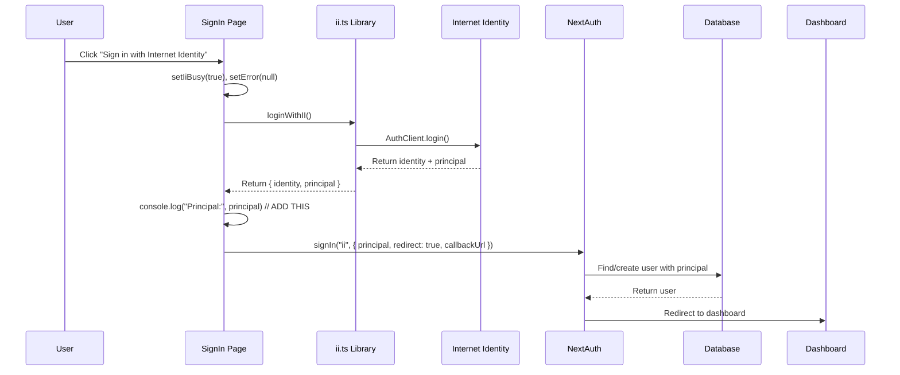

# Internet Identity Login Flow - Detailed Analysis

## Overview

This document provides a comprehensive analysis of the Internet Identity login flow in the signin page, covering function calls, data flow, avatar handling, and the relationship between different pages.

## Current Implementation Status

### **Files Involved in II Login Flow**

1. **`src/app/[lang]/signin/page.tsx`** - Main signin page with II button
2. **`src/ic/ii.ts`** - Internet Identity helper functions
3. **`auth.ts`** - NextAuth configuration (needs II provider)
4. **`src/app/[lang]/user/icp/page.tsx`** - Separate ICP testing page

## Internet Identity Login Flow Analysis

### **1. User Interaction Flow**



### **2. Detailed Function Call Analysis**

#### **Step 1: User Clicks II Button (`signin/page.tsx:96`)**

```typescript
<Button variant="outline" onClick={handleInternetIdentity} disabled={iiBusy || busy}>
  {iiBusy ? "Connecting to Internet Identity…" : "Sign in with Internet Identity"}
</Button>
```

**Triggered Function:**

```typescript
async function handleInternetIdentity() {
  if (iiBusy || busy) return;
  setError(null);
  setIiBusy(true);
  try {
    const { principal } = await loginWithII();
    // 🔥 ADD CONSOLE LOG HERE:
    console.log("🔐 [SignIn] Principal received:", principal);
    console.log("🔐 [SignIn] Principal length:", principal.length);
    console.log("🔐 [SignIn] Principal format check:", principal.includes("-"));

    await signIn("ii", { principal, redirect: true, callbackUrl });
  } catch (e) {
    const msg = e instanceof Error ? e.message : String(e);
    setError(`Internet Identity sign-in failed: ${msg}`);
  } finally {
    setIiBusy(false);
  }
}
```

#### **Step 2: `loginWithII()` Function (`src/ic/ii.ts:23`)**

```typescript
export async function loginWithII(): Promise<{ identity: Identity; principal: string }> {
  // 1. Get II provider URL
  const provider = process.env.NEXT_PUBLIC_II_URL || process.env.NEXT_PUBLIC_II_URL_FALLBACK;
  if (!provider) throw new Error("II URL not configured");

  // 2. Get cached AuthClient
  const authClient = await getAuthClient();

  // 3. Calculate session TTL
  const maxTimeToLive = getSessionTtlNs();

  // 4. Perform II authentication
  await new Promise<void>((resolve, reject) =>
    authClient.login({
      identityProvider: provider,
      ...(maxTimeToLive ? { maxTimeToLive } : {}),
      onSuccess: resolve,
      onError: reject,
    })
  );

  // 5. Extract identity and principal
  const identity = authClient.getIdentity();
  const principal = identity.getPrincipal().toString();

  // 🔥 ADD CONSOLE LOG HERE:
  console.log("🆔 [II] Identity created:", identity);
  console.log("🆔 [II] Principal extracted:", principal);
  console.log("🆔 [II] Principal getPrincipal():", identity.getPrincipal());

  return { identity, principal };
}
```

#### **Step 3: NextAuth `signIn()` Call**

```typescript
await signIn("ii", { principal, redirect: true, callbackUrl });
```

**What Happens:**

1. NextAuth looks for provider with id "ii" (currently doesn't exist)
2. **This call will FAIL** because the II provider is not yet configured in `auth.ts`
3. User will see error message

### **3. Data Flow and Object Structure**

#### **Principal Data Structure**

```typescript
// Example principal (from Internet Identity)
const principal = "rdmx6-jaaaa-aaaah-qcaiq-cai";

// Principal characteristics:
console.log("Principal:", principal); // "rdmx6-jaaaa-aaaah-qcaiq-cai"
console.log("Type:", typeof principal); // "string"
console.log("Length:", principal.length); // 29 characters
console.log("Contains dash:", principal.includes("-")); // true
console.log("Format:", /^[a-z0-9-]+$/.test(principal)); // true (lowercase alphanumeric + dashes)
```

#### **Identity Object Structure**

```typescript
// Identity object (from @dfinity/agent)
interface Identity {
  getPrincipal(): Principal;
  // ... other methods
}

// Principal object
interface Principal {
  toString(): string;
  toText(): string;
  // ... other methods
}
```

#### **Expected User Data Flow**

**When II provider is implemented in `auth.ts`:**

```typescript
// 1. Input to NextAuth
const loginData = {
  provider: "ii",
  credentials: {
    principal: "rdmx6-jaaaa-aaaah-qcaiq-cai",
  },
  callbackUrl: "/en/dashboard",
};

// 2. User object created/found
const user = {
  id: "uuid-generated",
  email: "rdmx6-jaaaa-aaaah-qcaiq-cai@internet-identity.ic",
  name: "IC User rdmx6-ja...caiq",
  image: null, // No image for II users initially
  role: "user",
};

// 3. Account linking
const account = {
  userId: "uuid-generated",
  type: "credentials",
  provider: "internet-identity",
  providerAccountId: "rdmx6-jaaaa-aaaah-qcaiq-cai",
};
```

### **4. Avatar/Image Handling Analysis**

#### **Current Avatar Sources (Other Providers)**

**GitHub Provider (`auth.ts:52`):**

```typescript
profile(profile) {
  return {
    // ...
    image: profile.avatar_url, // GitHub provides avatar URL
  };
}
```

**Google Provider (`auth.ts:69`):**

```typescript
profile(profile) {
  return {
    // ...
    image: profile.picture, // Google provides profile picture URL
  };
}
```

#### **Internet Identity Avatar Handling**

**Current Reality:**

- Internet Identity **does NOT provide profile pictures**
- II only provides identity/principal information
- No avatar URL available from II service

**Avatar Fallback Strategy:**

```typescript
// In user-button-client.tsx (lines 55-64)
<AvatarImage
  src={
    session.user.image ||  // Will be null for II users
    `https://api.dicebear.com/9.x/thumbs/svg?seed=${Math.floor(
      Math.random() * 100000 + 1
    )}&randomizeIds=true`   // Fallback: Random avatar
  }
  alt={name}
/>
<AvatarFallback className="text-xs font-medium">{initials}</AvatarFallback>
```

**For II Users:**

1. **`session.user.image`** will be `null` (no image from II)
2. **Fallback**: Random DiceBear avatar based on random seed
3. **Final Fallback**: User initials if image fails to load

**Improvement Needed:**

```typescript
// Better avatar for II users (in II provider configuration)
profile(credentials) {
  const principal = credentials.principal;
  return {
    // ...
    image: `https://api.dicebear.com/9.x/thumbs/svg?seed=${principal}&randomizeIds=false`,
    // Use principal as seed for consistent avatar per user
  };
}
```

### **5. Relationship: Signin Page vs ICP Testing Page**

#### **Key Differences**

| Aspect             | Signin Page (`/signin`)   | ICP Testing Page (`/user/icp`) |
| ------------------ | ------------------------- | ------------------------------ |
| **Purpose**        | Production authentication | Development/testing            |
| **Integration**    | NextAuth integration      | Standalone II testing          |
| **User Creation**  | Creates NextAuth user     | No user creation               |
| **Session**        | Creates NextAuth session  | No session persistence         |
| **Navigation**     | Redirects to dashboard    | Stays on same page             |
| **UI State**       | Modal overlay             | Full page                      |
| **Error Handling** | NextAuth error flow       | Custom error handling          |

#### **Code Architecture**

**Signin Page Flow:**

```typescript
// signin/page.tsx
handleInternetIdentity() -> loginWithII() -> signIn("ii") -> NextAuth -> Database -> Dashboard
```

**ICP Testing Page Flow:**

```typescript
// user/icp/page.tsx
handleLogin() -> getAuthClient() -> authClient.login() -> Local state -> UI update
```

#### **Shared Dependencies**

**Both pages use:**

1. **`@dfinity/auth-client`** - Core II authentication
2. **`src/ic/agent.ts`** - Agent configuration and caching
3. **Environment variables** - II provider URLs and configuration

**Key Difference:**

- **Signin page**: Integrates II with NextAuth for full app authentication
- **ICP page**: Direct II integration for testing ICP functionality

### **6. Missing Implementation: II Provider in auth.ts**

#### **What's Missing**

Currently, the signin page calls:

```typescript
await signIn("ii", { principal, redirect: true, callbackUrl });
```

But there's **no "ii" provider** configured in `auth.ts`, so this fails.

#### **Required Implementation**

```typescript
// Add to auth.ts providers array
CredentialsProvider({
  id: "ii",
  name: "Internet Identity",
  credentials: {
    principal: { label: "Principal", type: "text" },
  },
  async authorize(credentials) {
    if (!credentials?.principal) return null;

    const principal = credentials.principal as string;
    console.log("🔑 [Auth] Authorizing II principal:", principal);

    // Validate principal format
    if (!/^[a-z0-9-]+$/.test(principal) || principal.length < 10) {
      console.error("🔑 [Auth] Invalid principal format:", principal);
      return null;
    }

    const iiEmail = `${principal}@internet-identity.ic`;

    // Find or create user
    let user = await db.query.users.findFirst({
      where: (users, { eq }) => eq(users.email, iiEmail),
    });

    if (!user) {
      console.log("🔑 [Auth] Creating new II user for principal:", principal);
      const [newUser] = await db
        .insert(users)
        .values({
          email: iiEmail,
          name: `IC User ${principal.slice(0, 8)}...${principal.slice(-4)}`,
          image: `https://api.dicebear.com/9.x/thumbs/svg?seed=${principal}&randomizeIds=false`,
          role: "user",
          emailVerified: new Date(),
        })
        .returning();
      user = newUser;
    }

    console.log("🔑 [Auth] II user authorized:", user.id);
    return {
      id: user.id,
      email: user.email,
      name: user.name,
      image: user.image,
      role: user.role,
    };
  },
});
```

### **7. Console Logging Strategy**

#### **Add These Console Logs**

**1. In `signin/page.tsx` (`handleInternetIdentity`):**

```typescript
const { principal } = await loginWithII();
console.log("🔐 [SignIn] Principal received:", principal);
console.log("🔐 [SignIn] About to call signIn with provider 'ii'");
```

**2. In `src/ic/ii.ts` (`loginWithII`):**

```typescript
const principal = identity.getPrincipal().toString();
console.log("🆔 [II] Principal extracted:", principal);
console.log("🆔 [II] Principal type:", typeof principal);
console.log("🆔 [II] Principal length:", principal.length);
return { identity, principal };
```

**3. In `auth.ts` (II provider `authorize` function):**

```typescript
async authorize(credentials) {
  console.log("🔑 [Auth] II authorize called with:", credentials);
  const principal = credentials.principal as string;
  console.log("🔑 [Auth] Processing principal:", principal);
  // ... rest of function
}
```

### **8. Complete Flow Summary**

#### **Current State (Incomplete)**

1. ✅ User clicks II button on signin page
2. ✅ `handleInternetIdentity()` calls `loginWithII()`
3. ✅ II authentication popup appears and succeeds
4. ✅ Principal is extracted and returned
5. ❌ `signIn("ii")` **fails** - no II provider configured
6. ❌ User sees error message

#### **After Implementation (Complete)**

1. ✅ User clicks II button on signin page
2. ✅ `handleInternetIdentity()` calls `loginWithII()`
3. ✅ II authentication popup appears and succeeds
4. ✅ Principal is extracted and returned
5. ✅ `signIn("ii")` succeeds - II provider processes principal
6. ✅ User created/found in database
7. ✅ NextAuth session created
8. ✅ User redirected to dashboard
9. ✅ Avatar shows DiceBear image based on principal

### **9. Next Steps for Implementation**

1. **Add console logs** as specified above for debugging
2. **Implement II provider** in `auth.ts`
3. **Test the complete flow** end-to-end
4. **Verify avatar handling** for II users
5. **Add error handling** for edge cases

The signin page II integration is **90% complete** - it just needs the NextAuth provider configuration to handle the principal and create/authenticate users.
