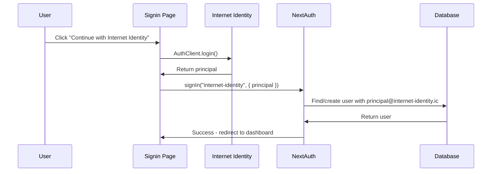

# Internet Identity Provider Implementation in auth.ts

## Overview

This document outlines how to implement Internet Identity as a NextAuth provider in the `auth.ts` configuration file, integrating seamlessly with the existing authentication system.

## Current auth.ts Structure

### **File Location**: `src/nextjs/auth.ts`

### **Current Provider Configuration**

```typescript
export const { handlers, auth, signIn, signOut } = NextAuth({
  adapter: DrizzleAdapter(db),
  session: { strategy: "jwt" },
  providers: [
    // OAuth Providers
    GitHub({
      clientId: process.env.AUTH_GITHUB_ID!,
      clientSecret: process.env.AUTH_GITHUB_SECRET!,
      profile(profile) {
        return {
          id: profile.id.toString(),
          email: profile.email,
          name: profile.name,
          image: profile.avatar_url,
          role: "user" as string,
        };
      },
    }),
    Google({
      clientId: process.env.AUTH_GOOGLE_ID!,
      clientSecret: process.env.AUTH_GOOGLE_SECRET!,
      profile(profile) {
        return {
          id: profile.sub,
          email: profile.email,
          name: profile.name,
          image: profile.picture,
          role: "user",
        };
      },
    }),
    // Credentials Provider
    CredentialsProvider({
      name: "credentials",
      credentials: {
        email: { label: "Email", type: "email" },
        password: { label: "Password", type: "password" },
      },
      async authorize(credentials) {
        // Email/password validation logic
      },
    }),
  ],
  // ... callbacks, events, etc.
});
```

## Internet Identity Provider Implementation

### **1. Add Required Imports**

```typescript
// Add to existing imports at top of auth.ts
import { AuthClient } from "@dfinity/auth-client";
```

### **2. Internet Identity CredentialsProvider**

Add this provider to the `providers` array:

```typescript
CredentialsProvider({
  id: "internet-identity",
  name: "Internet Identity",
  credentials: {
    principal: { label: "Principal", type: "text" },
  },
  async authorize(credentials) {
    try {
      // 1. Validate input
      if (!credentials?.principal || typeof credentials.principal !== "string") {
        console.error("[II Auth] No principal provided");
        return null;
      }

      const principal = credentials.principal;

      // 2. Validate principal format (basic sanity check)
      if (principal.length < 10 || !principal.includes("-")) {
        console.error("[II Auth] Invalid principal format:", principal);
        return null;
      }

      // 3. Create unique email identifier for II users
      const iiEmail = `${principal}@internet-identity.ic`;

      // 4. Find existing user or create new one
      let user = await db.query.users.findFirst({
        where: (users, { eq }) => eq(users.email, iiEmail),
      });

      if (!user) {
        console.log("[II Auth] Creating new user for principal:", principal);

        // Create new user for II principal
        const [newUser] = await db
          .insert(users)
          .values({
            email: iiEmail,
            name: `IC User ${principal.slice(0, 8)}...${principal.slice(-4)}`,
            role: "user",
            emailVerified: new Date(), // II users are pre-verified
          })
          .returning();

        user = newUser;
        console.log("[II Auth] Created user:", user.id);
      } else {
        console.log("[II Auth] Found existing user:", user.id);
      }

      // 5. Return user object for NextAuth
      return {
        id: user.id,
        email: user.email,
        name: user.name,
        role: user.role,
        image: user.image,
      };
    } catch (error) {
      console.error("[II Auth] Authorization failed:", error);
      return null;
    }
  },
}),
```

### **3. Updated Provider Array**

```typescript
providers: [
  GitHub({ /* existing config */ }),
  Google({ /* existing config */ }),
  CredentialsProvider({ /* existing email/password config */ }),
  CredentialsProvider({ /* NEW: Internet Identity config above */ }),
],
```

## Integration Points

### **How II Authentication Works**



### **Database Flow**

1. **User Table Entry**:

   ```sql
   INSERT INTO "user" (
     id, email, name, role, emailVerified
   ) VALUES (
     'uuid-generated',
     'rdmx6-jaaaa-aaaah-qcaiq-cai@internet-identity.ic',
     'IC User rdmx6-ja...caiq',
     'user',
     NOW()
   );
   ```

2. **Account Table Entry** (automatically created by NextAuth):

   ```sql
   INSERT INTO "account" (
     userId, type, provider, providerAccountId
   ) VALUES (
     'user-uuid',
     'credentials',
     'internet-identity',
     'rdmx6-jaaaa-aaaah-qcaiq-cai'
   );
   ```

3. **AllUsers Table Entry** (via existing `createUser` event):
   ```sql
   INSERT INTO "all_users" (
     type, userId
   ) VALUES (
     'user',
     'user-uuid'
   );
   ```

## File Structure Integration

### **Files to Modify**

#### **1. auth.ts** (Primary)

- Add II CredentialsProvider configuration
- Import AuthClient if needed for validation
- Handle principal-to-user mapping

#### **2. signin/page.tsx** (Secondary)

- Add "Continue with Internet Identity" button
- Implement II authentication flow
- Call `signIn("internet-identity", { principal })`

#### **3. Environment Variables** (.env.local)

```env
# Internet Identity Provider URLs
NEXT_PUBLIC_II_URL=https://id.ai/
NEXT_PUBLIC_II_URL_FALLBACK=https://identity.ic0.app/

# Session TTL
NEXT_PUBLIC_II_SESSION_TTL_HOURS=8
```

### **Files NOT Modified**

- ❌ Database schema - existing tables work perfectly
- ❌ User promotion logic - existing `createUser` event handles II users
- ❌ JWT/session callbacks - work with any provider
- ❌ Business logic - `allUsers` integration automatic

## Implementation Strategy

### **Phase 1: Basic Provider Setup**

1. **Add II provider to auth.ts**:

   ```typescript
   // Add to providers array
   CredentialsProvider({
     id: "internet-identity",
     // ... configuration above
   });
   ```

2. **Test with curl/Postman**:

   ```bash
   POST /api/auth/signin/internet-identity
   Content-Type: application/json

   {
     "principal": "rdmx6-jaaaa-aaaah-qcaiq-cai",
     "csrfToken": "...",
     "callbackUrl": "/dashboard"
   }
   ```

### **Phase 2: Frontend Integration**

1. **Update signin page** to include II button
2. **Implement II authentication flow** with AuthClient
3. **Test end-to-end** authentication

### **Phase 3: User Experience**

1. **Handle edge cases** (invalid principals, errors)
2. **Improve user names** (fetch from IC if possible)
3. **Add logout handling** (clear both NextAuth and AuthClient)

## Key Design Decisions

### **1. Principal as Email**

- **Decision**: Use `principal@internet-identity.ic` as unique email
- **Rationale**:
  - Ensures uniqueness in users table
  - Distinguishes II users from regular email users
  - Maintains NextAuth email-based user model

### **2. CredentialsProvider Pattern**

- **Decision**: Use CredentialsProvider instead of custom OAuth provider
- **Rationale**:
  - Simpler to implement
  - Better control over authentication flow
  - Easier to handle principal validation

### **3. User Creation Strategy**

- **Decision**: Auto-create users on first II login
- **Rationale**:
  - Smooth user experience
  - Consistent with OAuth provider behavior
  - Leverages existing user promotion logic

### **4. No Schema Changes**

- **Decision**: Use existing database structure
- **Rationale**:
  - Proven architecture
  - Minimal risk
  - Faster implementation

## Testing Checklist

### **Unit Tests**

- [ ] Principal validation
- [ ] User creation logic
- [ ] Error handling

### **Integration Tests**

- [ ] End-to-end II authentication
- [ ] User promotion logic with II users
- [ ] Session management
- [ ] Multiple provider coexistence

### **Manual Tests**

- [ ] II login flow
- [ ] Logout from both NextAuth and AuthClient
- [ ] Account linking scenarios
- [ ] Error states and recovery

## Security Considerations

### **Principal Validation**

```typescript
// Add to authorize function
function isValidPrincipal(principal: string): boolean {
  // Basic format validation
  if (typeof principal !== "string") return false;
  if (principal.length < 10 || principal.length > 100) return false;
  if (!principal.includes("-")) return false;
  if (!/^[a-z0-9-]+$/.test(principal)) return false;
  return true;
}
```

### **Rate Limiting**

- Consider adding rate limiting to II provider
- Monitor for abuse patterns
- Log authentication attempts

### **Session Security**

- II sessions inherit NextAuth JWT security
- TTL management via environment variables
- Proper logout handling required

## Next Steps

1. **Implement basic II provider** in auth.ts
2. **Test provider configuration** with manual requests
3. **Integrate with signin page** frontend
4. **End-to-end testing** and refinement
5. **Production deployment** and monitoring

The Internet Identity provider integration is designed to be **additive** - it slots into the existing NextAuth architecture without breaking existing functionality or requiring database migrations.
