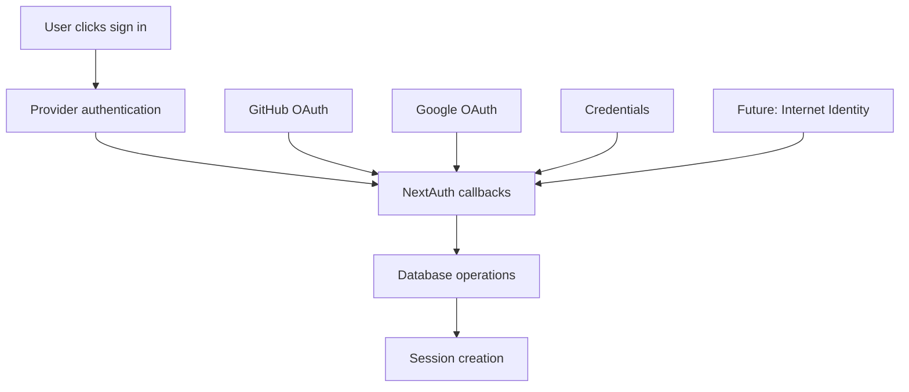

# NextAuth Database Flow Analysis

## Overview

This document analyzes how NextAuth login results get passed to and stored in the database, providing the foundation for understanding where Internet Identity integration should plug into the existing flow.

## Key Files

### 1. **NextAuth Configuration: `auth.ts`**

- Main NextAuth configuration file
- Defines providers, callbacks, and database integration
- Handles user creation and promotion logic

### 2. **Database Schema: `src/db/schema.ts`**

- Defines all database tables and relationships
- Contains NextAuth-required tables (`users`, `accounts`, `sessions`)
- Custom tables (`allUsers`, `temporaryUsers`) for business logic

### 3. **Database Connection: `src/db/db.ts`**

- Drizzle ORM configuration
- Database connection and adapter setup

## NextAuth Database Flow

### **Login Process Overview**



### **Provider Types and Database Flow**

#### **1. OAuth/OIDC Providers (GitHub, Google)**

**Authentication Flow:**

```typescript
// In auth.ts
GitHub({
  clientId: process.env.AUTH_GITHUB_ID!,
  clientSecret: process.env.AUTH_GITHUB_SECRET!,
  profile(profile) {
    return {
      id: profile.id.toString(),
      email: profile.email,
      name: profile.name,
      image: profile.avatar_url,
      role: "user" as string,
    };
  },
});
```

**Database Operations:**

1. **User Creation**: DrizzleAdapter automatically creates/updates `users` table entry
2. **Account Linking**: Creates `accounts` table entry linking user to provider
3. **Session**: Creates JWT session or database session
4. **Custom Logic**: `createUser` event triggers custom user promotion logic

#### **2. Credentials Provider (Email/Password)**

**Authentication Flow:**

```typescript
// In auth.ts - CredentialsProvider authorize function
async authorize(credentials) {
  // 1. Validate credentials format
  if (!credentials?.email || !credentials?.password) return null;

  // 2. Query existing user from database
  const user = await db.query.users.findFirst({
    where: (users, { eq }) => eq(users.email, email),
  });

  // 3. Verify password hash
  if (!user || !user.password) return null;
  const passwordMatch = await compare(password, user.password);
  if (!passwordMatch) return null;

  // 4. Return user object for NextAuth
  return {
    id: user.id,
    email: user.email,
    name: user.name,
    role: user.role,
  };
}
```

**Database Operations:**

- **No automatic user creation** - user must already exist in `users` table
- **Session creation** only - no `accounts` table entry created
- **Custom logic** still triggers in `createUser` event (if new user somehow created)

## Database Tables Structure

### **NextAuth Standard Tables**

#### **`users` Table**

```sql
CREATE TABLE "user" (
  "id" text PRIMARY KEY,
  "name" text,
  "email" text UNIQUE,
  "emailVerified" timestamp,
  "image" text,
  -- Custom fields
  "password" text,
  "role" text DEFAULT 'user',
  "createdAt" timestamp DEFAULT now()
);
```

#### **`accounts` Table**

```sql
CREATE TABLE "account" (
  "userId" text NOT NULL REFERENCES "user"("id"),
  "type" text NOT NULL,
  "provider" text NOT NULL,
  "providerAccountId" text NOT NULL,
  "access_token" text,
  "refresh_token" text,
  "expires_at" integer,
  PRIMARY KEY("provider", "providerAccountId")
);
```

#### **`sessions` Table**

```sql
CREATE TABLE "session" (
  "sessionToken" text PRIMARY KEY,
  "userId" text NOT NULL REFERENCES "user"("id"),
  "expires" timestamp NOT NULL
);
```

### **Custom Business Tables**

#### **`allUsers` Table**

```sql
CREATE TABLE "all_users" (
  "id" text PRIMARY KEY,
  "type" text, -- 'user' | 'temporary'
  "userId" text REFERENCES "user"("id"),
  "temporaryUserId" text REFERENCES "temporary_users"("id"),
  "businessUserId" text,
  "createdAt" timestamp DEFAULT now()
);
```

#### **`temporaryUsers` Table**

```sql
CREATE TABLE "temporary_users" (
  "id" text PRIMARY KEY,
  "email" text,
  "name" text,
  "createdAt" timestamp DEFAULT now()
);
```

## NextAuth Callbacks and Events

### **Key Callbacks in `auth.ts`**

#### **1. `callbacks.jwt`** (lines 159-217)

```typescript
async jwt({ token, account, user }) {
  // Add custom fields to JWT token
  if (account && user) {
    token.role = user.role;
    // Find and add businessUserId from allUsers table
    const allUser = await db.query.allUsers.findFirst({
      where: (allUsers, { eq }) => eq(allUsers.userId, user.id),
    });
    token.businessUserId = allUser?.businessUserId;
  }
  return token;
}
```

#### **2. `callbacks.session`** (lines 218-237)

```typescript
async session({ session, token }) {
  // Pass custom fields from token to session
  if (token) {
    session.user.role = token.role;
    session.user.businessUserId = token.businessUserId;
  }
  return session;
}
```

### **Key Events in `auth.ts`**

#### **1. `events.createUser`** (lines 241-296)

**Purpose**: Custom logic when new user is created

**Flow**:

1. **Check for temporary user** with same email
2. **If temporary user exists**:
   - Update `allUsers` to point to new permanent user
   - Delete temporary user entry
   - Promote temporary user data
3. **If no temporary user**:
   - Create new `allUsers` entry for the user

```typescript
async createUser({ user }) {
  // Check if there's a temporary user with the same email
  const temporaryUser = await db.query.temporaryUsers.findFirst({
    where: (temporaryUsers, { eq }) => eq(temporaryUsers.email, user.email!),
  });

  if (temporaryUser && allUserEntry) {
    // Promote temporary to permanent user
    await db.update(allUsers)
      .set({
        type: "user",
        userId: user.id,
        temporaryUserId: null,
      })
      .where(eq(allUsers.id, allUserEntry.id));
  } else {
    // Create new allUsers entry
    await db.insert(allUsers).values({
      type: "user",
      userId: user.id,
    });
  }
}
```

#### **2. `events.signIn`** (lines 301-302)

```typescript
async signIn({ user, account, profile }) {
  console.log("[Auth] 👋 User signed in:", { user, account, profile });
}
```

#### **3. `events.linkAccount`** (lines 298-299)

```typescript
async linkAccount(account) {
  console.log("[Auth] 🔗 Account linked:", account);
}
```

## Internet Identity Integration Points

### **Where II Would Plug In**

#### **1. New Provider Configuration**

```typescript
// Add to providers array in auth.ts
CredentialsProvider({
  id: "internet-identity",
  name: "Internet Identity",
  credentials: {
    principal: { label: "Principal", type: "text" },
  },
  async authorize(credentials) {
    if (!credentials?.principal) return null;

    // Validate principal format
    const principal = credentials.principal as string;

    // Find or create user based on principal
    let user = await db.query.users.findFirst({
      where: (users, { eq }) => eq(users.email, `${principal}@ic`),
    });

    if (!user) {
      // Create new user for II principal
      const [newUser] = await db
        .insert(users)
        .values({
          email: `${principal}@ic`, // Unique identifier
          name: `IC User ${principal.slice(0, 8)}...`,
          role: "user",
        })
        .returning();
      user = newUser;
    }

    return {
      id: user.id,
      email: user.email,
      name: user.name,
      role: user.role,
    };
  },
});
```

#### **2. Account Linking**

When II user signs in, NextAuth will automatically create:

```sql
INSERT INTO "account" (
  "userId",
  "type",
  "provider",
  "providerAccountId"
) VALUES (
  '<user_id>',
  'credentials',
  'internet-identity',
  '<principal_id>'
);
```

#### **3. Custom User Promotion**

The existing `createUser` event will handle II users the same way:

- Check for temporary users with matching email pattern
- Promote or create new `allUsers` entry
- Maintain business logic consistency

### **Database Schema Changes**

**✅ No schema changes required!**

- `accounts` table already supports any provider
- `users` table has all needed fields
- Custom business logic works with any user source

### **Environment Variables Needed**

```env
# Internet Identity Provider URL
NEXT_PUBLIC_II_URL=https://id.ai/
NEXT_PUBLIC_II_URL_FALLBACK=https://identity.ic0.app/

# Session TTL (hours)
NEXT_PUBLIC_II_SESSION_TTL_HOURS=8
```

## Implementation Strategy

### **Phase 1: Basic II Provider**

1. Add II CredentialsProvider to `auth.ts`
2. Update signin page to include II button
3. Test basic authentication flow

### **Phase 2: User Management**

1. Refine principal-to-user mapping strategy
2. Handle edge cases (duplicate principals, etc.)
3. Add proper error handling

### **Phase 3: Integration Testing**

1. Test with existing user promotion logic
2. Verify `allUsers` and business logic works
3. End-to-end testing with multiple providers

### **Phase 4: Production Hardening**

1. Add principal validation
2. Implement session management
3. Error monitoring and logging

## Key Insights

1. **Existing Flow is Provider-Agnostic**: The database integration works for any provider type
2. **Custom Business Logic Preserved**: `allUsers` promotion logic will work with II users
3. **No Schema Changes**: Current tables support II integration out of the box
4. **Account Linking**: II principals will be stored in `accounts.providerAccountId`
5. **Session Management**: JWT strategy works seamlessly with II authentication

## Next Steps

The most critical file to modify for II integration is **`auth.ts`** - specifically adding the Internet Identity CredentialsProvider to the providers array. All database operations will flow through the existing NextAuth + Drizzle integration automatically.
